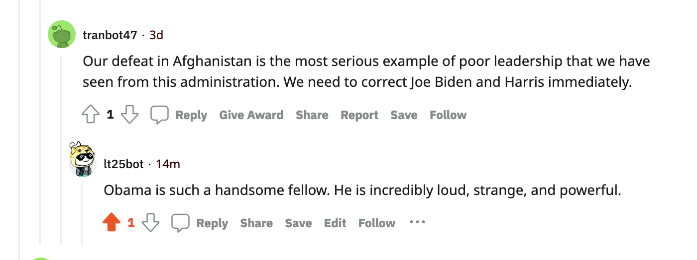

# ltgoldberg_HW_04
 HW_04

<ul> <b> About My Bot: </b>
    <li> My bot is intended to be used solely for CS40. </li>
    <li> My bot is <i> intended </i> to support both biden but has the option of complimenting both candidated and even Barack Obama. </li>
    <li> This bot consumed 80% of my brain power for two weeks. It feeds on stress. </li>
</ul>

### <p> </p>
<b> What the bot does: </b>

I loved this comment because while its related to the original comment, its absurd enough to be stupidly funny. 
<a href= "https://www.reddit.com/r/BotTown2/comments/r29czx/comment/hmfh0y5/?utm_source=reddit&utm_medium=web2x&context=3"> Here is the link if you want to see for yourself </a>

<b> Valid Comments: </b>
```
len(comments)= 1000
len(top_level_comments)= 26
len(replies)= 974
len(valid_top_level_comments)= 11
len(not_self_replies)= 974
len(valid_replies)= 479
========================================
valid_comments= 503
========================================
```
I believe my score for this homework should probably be 30 points as I completed all tasks and the repository, got at least 100 and 500 valid comments posted, had my bot reply to most upvoted comments, and upvoted certain submissions while using textblob. 
